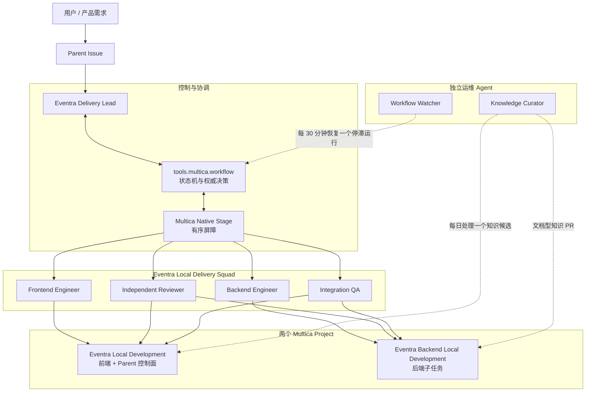
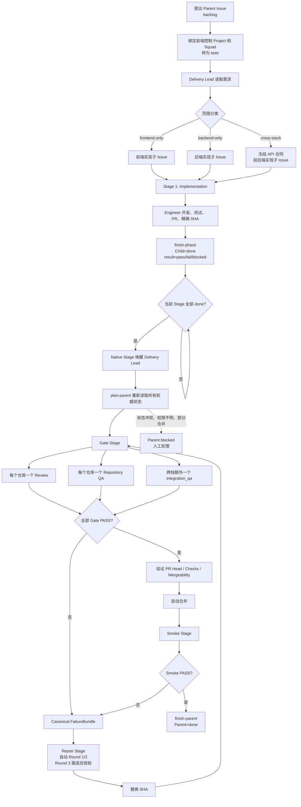
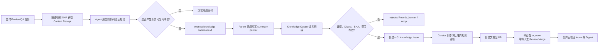

# Eventra Multica 自动化交付与知识闭环介绍

> 文档状态：当前实现说明  
> 适用范围：Eventra 本地开发交付环境  
> 工作流协议：`eventra.workflow.version=2`  
> 时区：`Asia/Shanghai`  
> 生产策略：生产部署始终由人工触发

## 1. 文档目的

本文完整介绍 Eventra 为 Multica 建设的自动化体系，包括：

- 为什么需要这套自动化；
- Squad、交付 Agent 与运维 Agent 的职责；
- 两个 Git 仓库和两个 Multica Project 如何组织；
- Issue 如何完成识别、拆分、派发、开发、测试、审核、修复、合并和验收；
- Native Stage、结构化 Metadata、精确 Commit SHA 和 PR 如何共同构成控制面；
- 定时 Watcher 如何恢复停滞任务；
- Knowledge Curator 如何把经过验证的经验异步沉淀为仓库知识；
- Provisioner、状态机、审计器和本地运行脚本分别承担什么工作；
- 系统如何保证幂等、权限隔离、密钥安全和失败时的可解释性。

本文面向项目维护者、技术负责人、自动化平台研发人员和需要操作 Eventra Multica 工作流的开发者。

---

## 2. 建设背景

Eventra 是一个前后端分仓项目：

- 前端：Next.js / React；
- 后端：Spring Boot；
- 两个仓库需要独立开发、测试、审核和提交 PR；
- 跨栈变更需要冻结接口合同，并在同一组精确 SHA 上完成集成验证。

仅仅把一个 Issue 分配给一个 Agent，并不能形成可靠的无人值守交付。早期试运行暴露过一个典型问题：

1. 子 Agent 的运行已经完成；
2. 子 Issue 仍停留在 `in_review`；
3. Parent 的 Stage 认为该子 Issue 尚未完成；
4. Stage 屏障无法打开；
5. Delivery Lead 不会被再次唤醒；
6. 工作流停在“代码已经做完，但无人继续协调”的状态。

这促成了当前最重要的语义分离：

> Issue 的 `done` 表示“本阶段执行已经结束”；阶段是否成功由独立的 `eventra.phase.result=pass|fail|blocked` 表示。

因此，Review 发现缺陷时，Review 子 Issue 也会结束为 `done + fail`。这样既不会把失败误报为成功，也不会阻塞 Stage 唤醒 Delivery Lead。

---

## 3. 建设目标与非目标

### 3.1 建设目标

系统需要做到：

1. 接收一个产品级 Parent Issue；
2. 自动识别为前端、后端或跨栈任务；
3. 按仓库拆分最小实现子 Issue；
4. 把子 Issue 路由给正确的 Engineer；
5. 以测试优先方式开发并创建 PR；
6. 以不可变 Commit SHA 进行独立 Review 和 QA；
7. 对 Gate 失败生成标准 FailureBundle；
8. 在受控轮次内自动修复并重新跑 Gate；
9. Gate 全部通过后自动合并；
10. 合并后运行本地 Smoke；
11. 将 Parent 自动完成为 `done`；
12. 在正常唤醒失效时，定时恢复一个已经存在的停滞运行；
13. 把经过验证、可复用且适合公开仓库的经验异步沉淀为知识文档。

### 3.2 明确的非目标

系统不负责：

- 自动部署生产环境；
- 绕过 Review、QA、测试或 Mergeability Gate；
- 让 Reviewer 或 QA 直接指挥 Engineer 修改代码；
- 让 Watcher 成为第二个 Delivery Lead；
- 自动回滚部分跨仓合并；
- 自动清理未知 worktree、stash、分支或本地进程；
- 把秘密、生产数据或个人数据沉淀为知识；
- 让 Knowledge Curator 自审、自合并或修改业务代码。

---

## 4. 总体架构

Eventra Multica 自动化由四层组成：

1. **声明式拓扑层**：定义 Agent、Squad、Project、技能、资源和 Autopilot；
2. **Issue 状态机层**：用 Parent、Child、Stage 和 Metadata 表达流程；
3. **交付执行层**：Engineer、Reviewer、QA 和 Delivery Lead 按角色完成工作；
4. **运维闭环层**：Watcher 恢复停滞运行，Knowledge Curator 异步整理知识。



### 4.1 关键架构原则

- **Issue 是控制面**：工作分配、阶段、证据和结果都记录在 Issue 体系中。
- **Stage 是同步屏障**：Delivery Lead 只在当前 Stage 的全部子任务执行结束后继续。
- **SHA 是质量身份**：Review、QA 和 Merge Gate 只对精确的 40 位 Commit SHA 有效。
- **Delivery Lead 是唯一 fan-in**：所有 Gate 结果统一汇聚到 Delivery Lead。
- **Core 是唯一决策来源**：`plan-parent` 生成 canonical JSON 和 FailureBundle。
- **执行与判断分离**：Core 做确定性判断，Delivery Lead 执行被授权的唯一动作。
- **运维 Agent 不加入 Squad**：Watcher 和 Curator 不接收普通产品 Issue。
- **默认失败关闭**：任何身份、Stage、SHA、PR、证据或权限不一致都会停止，而不是猜测。

---

## 5. 仓库、Project 与 Worktree 边界

### 5.1 权威仓库

| 领域 | 权威本地仓库 | 主要技术 | 本地端口 |
| --- | --- | --- | --- |
| 前端 | `/Users/didi/Eventra-workspace/Eventra` | Next.js / React | `3000` |
| 后端 | `/Users/didi/Eventra-workspace/Eventra-Backend` | Spring Boot | `8080` |

`/Users/didi/Eventra-workspace/Eventra/Backend` 是前端仓库中的重复后端目录，属于禁止路径。任何 Agent 都不得把它作为后端权威仓库进行检查、修改、测试、提交或资源注册。

### 5.2 两个 Multica Project

| Project | 用途 | 资源 |
| --- | --- | --- |
| `Eventra Local Development` | 所有 Parent Issue 的入口；承载前端子任务；version 2 的唯一 Parent 控制 Project | 前端 `local_directory` worktree |
| `Eventra Backend Local Development` | 承载后端实现、后端 Review、后端 QA 和后端 Repair 子任务 | 后端 `local_directory` worktree |

拆成两个 Project 的原因是 Multica 同一 daemon 下每个 Project 只允许一个 `local_directory` 资源。两个 Project 仍由同一个 `Eventra Local Delivery` Squad 协调。

### 5.3 Worktree 策略

- Multica 负责创建隔离 worktree；
- Agent 不创建嵌套 worktree；
- Review 和 QA 在提交的精确 SHA 上使用 detached HEAD；
- 不允许通过 `reset`、`clean`、`stash` 覆盖用户工作；
- 只允许进程所有者停止自己启动的本地服务；
- 发现未知端口占用时必须停止并报告，不能强制杀进程。

---

## 6. Squad 与 Agent 拓扑

当前 Eventra 配置声明七个 Agent 身份：五个交付成员和两个独立运维成员。

### 6.1 Eventra Local Delivery Squad

| Agent | Squad 身份 | 核心职责 | 明确禁止 |
| --- | --- | --- | --- |
| Eventra Delivery Lead | Leader | 需求识别、范围分类、任务拆分、Stage 创建、证据汇总、Gate 决策、自动合并、Parent 完成 | 修改业务代码、自行伪造 Gate、部署生产 |
| Eventra Frontend Engineer | Member | 前端实现、测试、提交、维护前端 PR、处理前端 Repair | 修改后端、审核自己、创建平行 Repair PR |
| Eventra Backend Engineer | Member | 后端实现、接口合同、测试、提交、维护后端 PR、处理后端 Repair | 修改前端、泄露环境变量、自审自批 |
| Eventra Integration QA | Member | 仓库级 QA、跨栈集成、精确 SHA 服务验证、Smoke | 修改业务代码、直接派发修复、合并 |
| Eventra Independent Reviewer | Member | 按仓库独立审核精确 SHA、检查需求、Diff、测试、安全与边界 | 修改实现、直接要求 Engineer 修复、合并 |

### 6.2 Squad 外运维 Agent

| Agent | 作用 | 调度方式 | 权限边界 |
| --- | --- | --- | --- |
| Eventra Workflow Watcher | 恢复停滞的既有运行 | 每 30 分钟 Autopilot | 不能建 Issue、建 Stage、生成 FailureBundle、修改代码、合并或部署 |
| Eventra Knowledge Curator | 验证知识候选，创建知识 Issue，准备文档型知识 PR | 每日 Autopilot；也可接收知识 Issue | 不能加入交付 Squad、修改交付状态、修改业务代码、自审或自合并 |

### 6.3 并发约束

Provisioner 将 Agent 对齐为 `max_concurrent_tasks=1`。其中 Delivery Lead 的单任务串行边界尤其重要：Repair 和 Smoke 使用 reservation + 幂等恢复，但不是通用数据库事务或 CAS；它们依赖唯一、串行的 Delivery Lead 执行者。

### 6.4 技能绑定

- 所有角色具备 `using-superpowers`；
- Delivery Lead 使用 brainstorming、writing-plans、verification；
- Engineer 使用 executing-plans、TDD、systematic-debugging、code-review 和 verification；
- Frontend Engineer 额外使用 React/Next.js 实践技能；
- Backend Engineer 额外使用 REST、testing-pyramid 和 Spring Security JWT 技能；
- Integration QA 额外使用 Playwright；
- Watcher 和 Curator 仅绑定最小的诊断与验证技能，不具备实现或部署技能。

技能来源固定为批准的公开 GitHub URL。相同技能名若对应不同来源，Provisioner 会在写入前停止。

---

## 7. Issue 生命周期总览



---

## 8. 需求识别、分类与拆分

### 8.1 Parent Issue 入口

所有产品级 Parent Issue 必须：

1. 创建在 `Eventra Local Development`；
2. 分配给 `Eventra Local Delivery`；
3. 从 `backlog` 移到 `todo`；
4. 包含需求目标、验收标准、约束和明确非目标。

Delivery Lead 首次运行时把 Parent 分类为：

- `frontend-only`：只影响前端；
- `backend-only`：只影响后端；
- `cross-stack`：前后端都受影响。

### 8.2 拆分规则

- 每个受影响仓库至少一个实现子 Issue；
- 前端子 Issue 留在前端控制 Project；
- 后端子 Issue 路由到后端 Project；
- 子 Issue 必须记录 Parent、仓库、Agent、验收标准、接口期望、基础 SHA 和证据要求；
- 跨栈任务必须先冻结接口合同；
- 只有接口冻结且不存在真实依赖时，前后端才能并行；
- 有生产者/消费者依赖时，必须显式排序并交接生产者的精确 SHA。

### 8.3 Parent 初始化

Delivery Lead 将 Parent 转为 `in_progress`，并写入 version-2 控制 Metadata，包括：

| Metadata | 作用 |
| --- | --- |
| `eventra.workflow.version` | 工作流协议版本，当前为字符串 `2` |
| `eventra.workflow.classification` | 前端、后端或跨栈分类 |
| `eventra.workflow.next_stage` | 下一次允许创建的 Stage 序号 |
| `eventra.workflow.attempt` | 当前 Repair 轮次 |
| `eventra.workflow.frontend_sha` | 当前前端候选 SHA |
| `eventra.workflow.backend_sha` | 当前后端候选 SHA |
| `eventra.workflow.merge_state` | `not_ready`、`ready`、`merged` 或 `partial` |
| `eventra.workflow.last_action` | 去重和重放使用的稳定动作身份 |

实现子 Issue 先以 `backlog` 创建。Delivery Lead 写入并复核其 Stage、仓库目标、Engineer 角色、Agent/Project 身份、基础 SHA 和 creation action 后，才允许启动 Agent。

---

## 9. Stage 与状态语义

### 9.1 Stage 的作用

Multica Native Stage 是主协调机制。一个 Stage 中的所有子 Issue 都进入 `done` 后，Parent 的 Delivery Lead 才会被唤醒。

Stage 序号必须：

- 从 1 开始；
- 单调递增；
- 永不复用；
- 与 `eventra.workflow.next_stage` 一致；
- 与稳定 action key 绑定。

### 9.2 Issue 状态与阶段结果分离

| 维度 | 字段 | 含义 |
| --- | --- | --- |
| Issue 生命周期 | `status=done` | Agent 已完成本阶段执行，证据已经可供 Parent 读取 |
| 阶段判断 | `eventra.phase.result=pass` | 本阶段通过 |
| 阶段判断 | `eventra.phase.result=fail` | 已确认存在失败或缺陷 |
| 阶段判断 | `eventra.phase.result=blocked` | 执行已结束，但必要输入、环境或检查无法完成 |

FAIL 和 BLOCKED 子任务同样转为 `done`，从而打开 Stage 屏障。只有 Delivery Lead 能根据完整证据决定下一阶段。

### 9.3 子阶段 Metadata

执行子 Issue 使用的主要字段包括：

| Metadata | 作用 |
| --- | --- |
| `eventra.workflow.version` | 子任务所属协议版本 |
| `eventra.phase.kind` | `implementation`、`review`、`qa`、`integration_qa`、`repair` 或 `smoke` |
| `eventra.phase.result` | `pass`、`fail` 或 `blocked` |
| `eventra.phase.attempt` | Repair/验证轮次 |
| `eventra.phase.sha.frontend` | 前端精确 SHA |
| `eventra.phase.sha.backend` | 后端精确 SHA |
| `eventra.phase.pr` | 实现或 Repair 使用的 canonical PR URL |
| `eventra.phase.evidence_comment` | 证据评论 UUID |
| `eventra.phase.evidence_comment_url` | 非 PASS Gate 的 canonical HTTPS 评论 URL |
| `eventra.phase.failure_repositories` | 非 PASS Gate 声明的合法 Repair owner |
| `eventra.phase.creation_action` | 创建该 Stage/子任务的权威动作 |
| `eventra.phase.target` | `repository:frontend`、`repository:backend` 或 suite target |
| `eventra.phase.role` | 被授权执行该子任务的规范角色 |

所有控制字段都是字符串值，避免 CLI 类型推断差异。秘密、环境变量值、原始 webhook、生产 payload 和自由文本 prompt 都禁止进入 Metadata。

---

## 10. Stage 1：实现、测试与 PR

### 10.1 Engineer 的输入

Engineer 开始前必须确认：

- 当前活动的 implementation 或 repair 子 Issue；
- Parent 和当前 Stage；
- 权威仓库边界；
- 验收标准；
- 基础 SHA；
- 跨栈任务的冻结接口；
- Repair 时的不可变 FailureBundle、合法 owner 和现有 managed PR。

一个已经完成的子 Issue、Review 评论、QA 提及或 PR 提及都不构成新的编码权限。

### 10.2 开发规则

- 行为变更使用测试优先开发；
- 每个仓库最多一个受控 PR；
- Repair 继续使用现有 PR，不创建替代 PR；
- PR body 使用 `Closes PRO-N` 关联实现子 Issue；
- PR body 使用 `Related to PRO-M` 关联 Parent；
- 返回仓库、分支、PR、精确 SHA、变更路径、命令、退出码、测试结果和已知风险。

第一次权威 implementation 完成会建立该仓库 canonical managed PR。之后所有重放、Repair、Gate 和 Merge 都必须继续匹配这个 PR 身份和 Head SHA。

### 10.3 完成实现阶段

前端示例：

```bash
python3 -B -m tools.multica.workflow finish-phase PRO-N \
  --kind implementation \
  --result pass \
  --attempt 0 \
  --frontend-sha FULL_SHA \
  --evidence-comment COMMENT_UUID \
  --pr CANONICAL_PR_URL
```

后端使用 `--backend-sha`。Repair 使用 `--kind repair`，并且 PASS 必须产生真实的新 SHA；被拒绝 SHA 原样不变不能视为修复成功。

`finish-phase` 会：

1. 读取并验证子 Issue；
2. 读取 Parent、Squad、Agent、Project 和 assignment authority；
3. 检查证据评论身份；
4. 写入受控 Metadata；
5. 每个写入边界前重新确认权威状态；
6. 将子 Issue 转为 `done`；
7. 写后读取确认；
8. 对相同请求提供零重复写入的幂等重放。

---

## 11. Gate Stage：Review、Repository QA 与 Integration QA

### 11.1 Gate 的精确成员结构

Version 2 对 Gate Stage 的成员数量和类型有严格规定：

- 每个受影响仓库一个 `review` 子 Issue；
- 每个受影响仓库一个 `qa` 子 Issue；
- 跨栈变更额外增加一个 `integration_qa` 子 Issue，验证完整前后端 SHA 对。

不能用一个“综合审核 Issue”隐式代替多个仓库身份，也不能把一个仓库 QA 的单 SHA 结果当成跨栈 suite 结果。

### 11.2 Independent Reviewer

Reviewer：

- 每次只审核一个仓库的一个精确 SHA；
- 检查需求、Diff、测试、安全影响和仓库边界；
- 使用 detached HEAD；
- 先在当前 Review 子 Issue 发布证据评论；
- 再调用 `finish-phase`；
- 非 PASS 时声明合法 Repair owner 和 canonical HTTPS 证据 URL；
- 不修改代码，不生成 FailureBundle，不直接通知 Engineer 修复。

### 11.3 Repository QA

Repository QA 同样绑定单仓库、单 SHA：

- 前端 QA 只带 `--frontend-sha`；
- 后端 QA 只带 `--backend-sha`；
- FAIL/BLOCKED 必须声明对应仓库为 Repair owner；
- PASS 不携带 failure-only 字段。

### 11.4 Cross-stack Integration QA

跨栈 Integration QA 使用完整候选 SHA 集合：

1. 在后端 Project 验证后端精确 SHA；
2. Backend Engineer 启动同一 SHA 的后端服务；
3. 记录 daemon、SHA、启动命令、退出状态和安全的 readiness 结果；
4. Integration QA 在前端 Project 使用精确前端 SHA 访问 `localhost:8080`；
5. 验证冻结接口和端到端行为；
6. 测试后由进程所有者停止已知服务。

无法证明运行服务的 SHA、daemon 或 readiness 时，Gate 必须 BLOCKED，不能跳过。

### 11.5 Gate Fan-in

Delivery Lead 必须等当前 Gate Stage 的所有成员都终态后，再调用：

```bash
python3 -B -m tools.multica.workflow plan-parent PRO-M
```

`plan-parent` 是唯一 fan-in 和决策来源。它会重新验证：

- version-2 Parent；
- 当前 Stage 和精确子成员集合；
- Agent、Project、Squad 和角色身份；
- 候选 SHA map；
- managed PR URL 和当前 Head；
- Review/QA verdict；
- 证据评论 UUID、Issue、作者和当前 assignee；
- 非 PASS 的证据 URL 与合法 Repair owner；
- Mergeability 和 repository checks。

返回值是 canonical JSON，包含 `decision`、`action_key`、`reason` 和必要时的 `failure_bundle`。Core 只做判断，不直接创建 Stage 或子 Issue。

---

## 12. FailureBundle 与 Repair 闭环

### 12.1 为什么需要 FailureBundle

Reviewer 和 QA 不能直接把失败派给 Engineer，否则会出现：

- 多个 Gate 同时发出相互冲突的修复要求；
- Repair owner 不明确；
- 失败证据和被拒绝 SHA 无法绑定；
- 重试时重复创建 Repair Issue；
- Engineer 根据聊天或 Mention 修改代码，绕过控制面。

因此只有 `plan-parent` 在完整 Gate fan-in 后生成标准 FailureBundle。

### 12.2 FailureBundle 内容

FailureBundle 绑定：

- Parent 和来源 Gate Stage；
- 下一 Stage 和 action key；
- 当前候选 SHA map；
- canonical managed PR；
- 所有非 PASS verdict；
- 证据评论 UUID 和 canonical URL；
- 合法 Repair owner；
- Bundle digest；
- Repair round。

Delivery Lead 必须原样使用 Core 返回的 bundle 和 digest，不能用自然语言重建。

### 12.3 Repair 执行器

唯一允许的 Repair 创建路径是：

```bash
python3 -B -m tools.multica.workflow execute-parent-repair PRO-M \
  --expected-action-key ACTION_KEY
```

执行器会：

1. 重新加载 Parent 和当前 Gate；
2. 重新运行规划并核对 expected action key；
3. 写入 `eventra.workflow.repair_reservation`；
4. 按合法 owner 创建一个或多个 backlog Repair 子 Issue；
5. 写入 creation action、bundle digest、证据 UUID、round、managed PR 和被拒绝 SHA map；
6. 复核每个字段；
7. 提交 Parent 的 attempt、next_stage 和 last_action；
8. 启动精确的 Engineer；
9. 最后清除 reservation。

若进程在创建子 Issue 后中断，重试会把不完整子 Issue暂时隔离出 Stage fan-in，只补写缺失的 canonical Metadata 后缀。任何额外或冲突 Metadata 都不会被覆盖。

### 12.4 Repair 轮次

- Round 1：自动；
- Round 2：自动；
- Round 3：只接受 Parent 线程中 `author_type=member` 的精确授权评论；
- Round 3 只能授权当前 FailureBundle 一次；
- Round 3 再失败后 Parent 必须 BLOCKED；
- 不存在自动 Round 4。

### 12.5 新 SHA 与 Gate 失效

Repair PASS 必须产生新的 owned repository SHA。Delivery Lead 在所有 Repair owner 完成后，把精确 replacement SHA map 复制到 Parent candidates。未受影响仓库保持来源 SHA。

任何新 Commit 都使旧 Review 和 QA 失效。替换 SHA 必须重新建立完整 Gate Stage；旧 PASS 不能继承。

---

## 13. 自动合并与 Smoke

### 13.1 合并 Gate

只有以下事实同时成立时才能自动合并：

- 当前 implementation/repair PR Head 等于 Parent candidate SHA；
- 当前 Review 对同一 SHA PASS；
- 当前 Repository QA 对同一 SHA PASS；
- 跨栈 Integration QA 对同一 SHA 对 PASS；
- 本地测试和构建通过；
- 所需 repository checks 通过；
- PR 仍然 open 且 mergeable；
- 没有新 Commit 使证据失效。

跨仓合并必须在两个 PR 都通过一个协调 Gate 后，按接口兼容顺序连续执行。

如果第一个仓库已经合并，而第二个合并失败：

- 将 `merge_state` 记录为 `partial`；
- Parent 进入 BLOCKED；
- 记录已合并仓库/SHA、未合并仓库/原因和接口影响；
- 不自动回滚；
- 不继续部署；
- 交由人工选择兼容、补救或回滚方案。

### 13.2 Smoke 执行器

合并后不能手工创建 Smoke 子 Issue，只允许执行：

```bash
python3 -B -m tools.multica.workflow execute-parent-smoke PRO-M \
  --expected-action-key ACTION_KEY
```

Smoke 执行器会重新验证已完成 Gate、merged PR、候选 SHA map 和 Integration QA assignment，然后：

1. 写入 `eventra.workflow.smoke_reservation`；
2. 创建一个 backlog Smoke 子 Issue；
3. 写入 `suite:smoke`、Integration QA 角色和完整 SHA map；
4. 启动 Integration QA；
5. 写入 Parent action；
6. 验证效果后清除 reservation。

重试能够恢复“未创建”“Metadata 只写了一部分”“未启动”或“写成功但响应丢失”等状态，不会重复创建子 Issue。

### 13.3 Parent 完成

Smoke PASS 后 Delivery Lead 执行：

```bash
python3 -B -m tools.multica.workflow finish-parent PRO-M
```

`finish-parent` 会连续两次读取完整 Parent Snapshot 和决策。只有两次结果完全一致且都是 `complete_parent` 时，才把 Parent 从 `in_progress`/`in_review` 转为 `done`。

常规本地交付不会停在 `in_review` 等待人工接受。生产部署仍然完全独立，需要新的人工权限。

---

## 14. 定时任务一：Stalled Work Watcher

### 14.1 配置

| 属性 | 值 |
| --- | --- |
| Autopilot | `Eventra · Stalled Work Watcher` |
| Agent | `Eventra Workflow Watcher` |
| 模式 | `run_only` |
| Cron | `*/30 * * * *` |
| 时区 | `Asia/Shanghai` |
| 频率 | 每小时第 0 和 30 分钟 |
| 并发 | 1 |
| Project 范围 | 前端控制 Project + 后端子任务 Project |
| 每次最大恢复量 | 1 个既有运行 |

执行命令由 Provisioner 渲染为：

```text
python3 -B -m tools.multica.workflow watch \
  --project-id FRONTEND_PROJECT_ID \
  --backend-project-id BACKEND_PROJECT_ID \
  --apply
```

### 14.2 Watcher 的定位

Native Stage 是主协调路径，Watcher 只是恢复保险。它检查：

- Parent 是否属于唯一前端控制 Project；
- Parent 是否是 version 2；
- 当前 Stage 是否完整；
- 当前 Agent、角色、Project 和 Squad 是否匹配；
- 当前候选 SHA、PR 和 creation action 是否一致；
- Repair 时 bundle、证据、round 和来源 SHA 是否一致；
- 是否已经存在 active run；
- 是否确实出现“应当有后续运行但没有”的停滞。

Watcher 可以 rerun 一个精确的当前 assignment，并在写后确认出现新的 active task。

Watcher不能：

- 新建 Issue、Stage、PR 或评论；
- 写 Parent Metadata、状态或 action history；
- 生成 FailureBundle；
- 派发 Repair；
- 修改 attempt 或候选 SHA；
- Review、QA、合并或部署；
- 获取后端秘密。

Version 1 仅作为历史读取，不允许 Watcher 产生任何变更。活动的 version-1 Parent 必须显式迁移后才能继续。

---

## 15. 异步仓库知识闭环

主交付工作流之外，系统增加了一条不阻塞交付的知识闭环。



### 15.1 任务开始时的知识检索

每个交付、Review 和 QA 任务开始前，从前端控制仓库运行只读上下文检索：

```bash
python3 -B -m tools.multica.knowledge context \
  --task-id PRO-N \
  --repository frontend \
  --task-type implementation \
  --sha frontend=FULL_SHA \
  --path src/PATH
```

输出是与任务路径和 SHA 绑定的 Context Receipt。Agent 不能盲信历史知识，必须用当前代码、测试或权威合同复核重要结论；冲突时以当前代码和精确 SHA 为准。

### 15.2 知识候选

若任务中出现新的、已验证、可复用且适合公开仓库的事实，可以生成一个 `eventra-knowledge-candidate-v1` 区块。候选必须：

- 绑定 Parent、Child、证据评论和候选 SHA；
- 指定目标仓库和知识类型；
- 使用 canonical JSON；
- 包含内容 digest；
- 不包含秘密、个人数据、生产 payload 或原始日志。

候选不会阻塞交付，也不会授权当前业务 PR 顺手修改知识。Parent 完成时只发布机器可读 summary pointer，不复制候选正文。

### 15.3 定时任务配置

| 属性 | 值 |
| --- | --- |
| Autopilot | `Eventra · Knowledge Curator` |
| Agent | `Eventra Knowledge Curator` |
| 模式 | `run_only` |
| Cron | `17 2 * * *` |
| 时区 | `Asia/Shanghai` |
| 频率 | 每天 02:17 |
| 每次最大处理量 | 1 个候选 |

计划任务只运行一次受控 curation pass：

```text
python3 -B -m tools.multica.knowledge curate \
  --project-id FRONTEND_PROJECT_ID \
  --backend-project-id BACKEND_PROJECT_ID \
  --curator-agent-id KNOWLEDGE_CURATOR_AGENT_ID \
  --apply
```

### 15.4 Curator 的工作边界

Curator 可以：

- 验证 index、内容 digest、证据链、SHA 和仓库路由；
- 每次最多创建一个知识 Issue；
- 使用专用分支 `eventra-knowledge/CANDIDATE_DIGEST`；
- 只修改批准的知识路径；
- 创建一个 documentation-only PR；
- 记录 PR 的 source branch、Head SHA 和状态；
- 在人工合并后验证 merge SHA 与 index entry。

允许的知识路径：

- `AGENTS.md`；
- `docs/agent-knowledge/**`；
- 前端仓库的 `docs/delivery-knowledge/**`。

Curator 不能：

- 修改业务代码、依赖、构建、运行或部署配置；
- 改变 Parent、Stage、Gate、候选 SHA 或 Merge 状态；
- 自己批准或合并知识 PR；
- 自动重建被拒绝或关闭的 PR；
- 读取后端秘密；
- 覆盖其他贡献者的改动。

---

## 16. Provisioner：声明式配置与幂等对齐

### 16.1 Provisioner 管理的对象

`tools.multica.provision` 按精确名称对齐：

- 公开技能及其批准来源；
- 七个 Eventra Agent；
- Agent persistent instructions；
- Agent 技能绑定；
- Backend Engineer 和 Integration QA 的 custom environment；
- 五人 `Eventra Local Delivery` Squad；
- Squad leader 和 member role；
- 两个 Project；
- 两个本地 worktree 资源；
- Workflow Watcher Autopilot 及 trigger；
- Knowledge Curator Autopilot 及 trigger。

它只处理 Eventra 精确命名对象，不删除或清理无关 Agent、Squad、Project、Autopilot、trigger、worktree 或本地进程。

### 16.2 Dry-run

默认命令是只读 dry-run：

```bash
python3 -B -m tools.multica.provision \
  --runtime-id RUNTIME_ID \
  --daemon-id DAEMON_ID
```

Dry-run 输出确定性 JSON：

- `actions`：根据当前权威状态计算的拟执行动作；
- `preconditions`：缺失输入或冲突；
- `summary`：按 action/kind 汇总；
- `mutation_count=0`；
- 不打印环境变量键和值。

Dry-run 只是审阅输入，不产生可复用的授权 token。后续 `--apply` 会重新读取当前状态。

### 16.3 Apply

确认 dry-run 后显式执行：

```bash
python3 -B -m tools.multica.provision \
  --runtime-id RUNTIME_ID \
  --daemon-id DAEMON_ID \
  --apply
```

每次 mutation 后，Provisioner 都重新读取目标对象并验证最终状态。第二次对已收敛状态执行 apply，应报告 `mutation_count=0`。

### 16.4 环境权限

只有以下两个 Agent 接收后端 custom environment：

- Eventra Backend Engineer；
- Eventra Integration QA。

所需变量由 stdin 传入，不进入 argv。Watcher、Curator、Delivery Lead、Frontend Engineer 和 Reviewer 都不接收后端环境。

如果两个接收者已有有效且相同的环境，默认模式可以证明收敛；若缺失、冲突或需要显式复用，dry-run 会返回 sanitized precondition，而不是猜测或打印内容。

### 16.5 Contract Audit

发生 CLI 版本变化或中断恢复时，先运行：

```bash
python3 -B -m tools.multica.contract_audit \
  --runtime-id RUNTIME_ID \
  --daemon-id DAEMON_ID
```

Audit 只输出结构、键、数组长度和目标 ID 相等关系；不会输出业务标量、环境内容或秘密，也不支持 `--apply`。

---

## 17. 核心脚本与文件清单

### 17.1 Multica 自动化核心

| 文件 | 作用 |
| --- | --- |
| [`tools/multica/blueprint.py`](../../tools/multica/blueprint.py) | 定义项目无关的五角色交付 Squad 和基础 Workflow Watcher |
| [`tools/multica/eventra_adapter.py`](../../tools/multica/eventra_adapter.py) | 组合 Eventra 路径、技能、Project、Curator 和两个 Autopilot |
| [`tools/multica/provision.py`](../../tools/multica/provision.py) | Dry-run、Apply、Agent/Squad/Project/资源/Autopilot 幂等对齐 |
| [`tools/multica/contracts.py`](../../tools/multica/contracts.py) | Runtime、Agent、Skill、Squad、Project 和 Autopilot CLI 合同 |
| [`tools/multica/issue_contracts.py`](../../tools/multica/issue_contracts.py) | Issue、Children、Run、Metadata、评论和状态合同 |
| [`tools/multica/url_contracts.py`](../../tools/multica/url_contracts.py) | Canonical 评论 URL 等轻量 URL 合同 |
| [`tools/multica/contract_audit.py`](../../tools/multica/contract_audit.py) | 无标量、只读 CLI 结构审计 |
| [`tools/multica/workflow.py`](../../tools/multica/workflow.py) | Version-2 Stage 状态机、Finish、Plan、Repair、Smoke、Watcher |
| [`tools/multica/knowledge_contracts.py`](../../tools/multica/knowledge_contracts.py) | 知识 index、candidate、receipt 和 provenance 合同 |
| [`tools/multica/knowledge.py`](../../tools/multica/knowledge.py) | Context、Candidate、Summary、Scan、Plan、Curate、PR 状态与合并验证 |

### 17.2 角色与 Project 指令

| 文件 | 作用 |
| --- | --- |
| [`instructions/squad.md`](../../tools/multica/instructions/squad.md) | Squad 总体协作合同 |
| [`instructions/delivery_lead.md`](../../tools/multica/instructions/delivery_lead.md) | Delivery Lead 编排、Gate、Repair、Merge 和完成协议 |
| [`instructions/frontend_engineer.md`](../../tools/multica/instructions/frontend_engineer.md) | 前端实现和 Repair 权限 |
| [`instructions/backend_engineer.md`](../../tools/multica/instructions/backend_engineer.md) | 后端实现、接口和环境权限 |
| [`instructions/independent_reviewer.md`](../../tools/multica/instructions/independent_reviewer.md) | 单仓库精确 SHA Review 协议 |
| [`instructions/integration_qa.md`](../../tools/multica/instructions/integration_qa.md) | Repository QA、Integration QA 与 Smoke 协议 |
| [`instructions/workflow_watcher.md`](../../tools/multica/instructions/workflow_watcher.md) | Watcher 最小权限合同 |
| [`instructions/stalled_work_watcher.md`](../../tools/multica/instructions/stalled_work_watcher.md) | Watcher 定时任务内容 |
| [`instructions/knowledge_curator.md`](../../tools/multica/instructions/knowledge_curator.md) | Curator 证据、路径和 PR 权限合同 |
| [`instructions/knowledge_curator_schedule.md`](../../tools/multica/instructions/knowledge_curator_schedule.md) | Curator 每日定时任务内容 |
| [`instructions/eventra_project.md`](../../tools/multica/instructions/eventra_project.md) | 前端/Parent 控制 Project 上下文 |
| [`instructions/eventra_backend_project.md`](../../tools/multica/instructions/eventra_backend_project.md) | 后端子任务 Project 上下文 |

### 17.3 前端本地脚本

| 脚本 | 用途 |
| --- | --- |
| [`scripts/run-local.sh`](../../scripts/run-local.sh) | 启动前端本地开发服务 |
| [`scripts/test-local-contract.sh`](../../scripts/test-local-contract.sh) | 验证本地配置和启动合同 |
| [`scripts/smoke-local.sh`](../../scripts/smoke-local.sh) | 运行前端本地 Smoke |
| `npm run test:local-contract` | 标准前端合同测试入口 |
| `npm run dev:local` | 标准前端开发启动入口 |
| `npm run smoke:local` | 标准前端 Smoke 入口 |

前端还包含针对 single-flight、layout hydration、footer metadata 和 dashboard profile 等行为的 Node 测试脚本，用于把 Agent 的质量检查变成确定性命令。

### 17.4 后端本地脚本

| 脚本 | 用途 |
| --- | --- |
| [`Eventra-Backend/scripts/java-env.sh`](../../../Eventra-Backend/scripts/java-env.sh) | 确定性选择 Java 环境并报告安全错误 |
| [`Eventra-Backend/scripts/test-local.sh`](../../../Eventra-Backend/scripts/test-local.sh) | 后端标准测试入口 |
| [`Eventra-Backend/scripts/test-local-wrapper.sh`](../../../Eventra-Backend/scripts/test-local-wrapper.sh) | 测试参数和环境包装 |
| [`Eventra-Backend/scripts/run-local.sh`](../../../Eventra-Backend/scripts/run-local.sh) | 启动后端本地服务 |
| [`Eventra-Backend/scripts/smoke-local.sh`](../../../Eventra-Backend/scripts/smoke-local.sh) | 后端本地 Smoke |
| [`Eventra-Backend/scripts/test-java-selection.sh`](../../../Eventra-Backend/scripts/test-java-selection.sh) | 验证 Java 选择逻辑 |

这些脚本确保 Multica 创建的新 worktree 不依赖主 checkout 中未跟踪的本地文件。

---

## 18. 幂等、并发与恢复设计

### 18.1 幂等身份

系统使用以下信息去重：

- 精确 Parent/Child Issue ID；
- 单调 Stage；
- `eventra.workflow.last_action`；
- canonical action key；
- FailureBundle digest；
- evidence comment UUID；
- managed PR URL；
- candidate SHA map；
- Repair/Smoke reservation；
- knowledge candidate digest。

### 18.2 写前与写后验证

所有关键 mutation 都遵循：

1. 读取当前权威状态；
2. 检查权限和前置条件；
3. 在 mutation 边界前再次读取；
4. 执行一个允许的写操作；
5. 重新读取确认实际效果；
6. 发现漂移立即停止；
7. 返回实际观察到的 mutation_count。

### 18.3 Lost acknowledgement

如果 CLI 写入成功但响应丢失，重试不会仅凭异常再写一次，而会重新读取状态：

- 效果完整：返回 noop/已收敛；
- 效果部分完成且前缀严格匹配：只补齐允许的后缀；
- 效果冲突或身份不一致：BLOCKED；
- 不自动删除未知对象。

### 18.4 Watcher 与 Delivery Lead 并发

Watcher 和 Delivery Lead 可以并发运行，但通过以下边界避免重复：

- Active run 检查；
- immutable assignment provenance；
- current Stage membership；
- action key；
- rerun 前后权威读取；
- 每次 Watcher 最多一个恢复动作。

如果 Delivery Lead 已经推进状态，Watcher 重新读取后返回 zero-mutation noop。

---

## 19. 安全与权限边界

### 19.1 密钥

后端密钥只能通过 custom environment 提供给 Backend Engineer 和 Integration QA。禁止进入：

- Git 文件；
- Issue body；
- 评论；
- Metadata；
- PR 描述；
- 命令行 argv；
- 日志；
- 审计输出；
- 知识候选。

### 19.2 Git 权限

- 实现 PR 使用用户个人 fork；
- 一个仓库一个 managed PR；
- Reviewer、QA 和 Watcher不能写实现分支；
- Curator 只能建立 `eventra-knowledge/<digest>` 文档分支；
- Push、Tag、Release 和生产部署需要独立权限；
- Curator 知识 PR 必须人工 Review/Merge。

### 19.3 生产边界

允许自动化的范围：

- 本地开发；
- 本地测试；
- 本地服务启动；
- 本地 Smoke；
- 满足 Gate 后合并批准的个人 fork PR。

不允许自动化的范围：

- 生产发布；
- 生产凭证；
- 生产数据；
- 自动回滚生产；
- 自动变更外部系统权限。

---

## 20. 失败处理与人工介入

下列情况会明确停止并要求人工处理：

- 需求、范围、验收标准或 merge authority 冲突；
- 缺少新的凭证、权限或外部授权；
- Parent 不属于前端控制 Project；
- Squad leader 或五人 membership 漂移；
- Stage、Agent、Project 或 phase target 身份不一致；
- 证据评论缺失、删除、作者错误或 UUID 不一致；
- PR URL、PR Head 或候选 SHA 漂移；
- FailureBundle 或 reservation 不完整/冲突；
- Round 3 未获成员授权或再次失败；
- 部分跨仓合并；
- 无法证明后端服务的精确 SHA；
- 未知端口进程；
- CLI 合同发生不兼容变化；
- 知识候选引用未知知识、证据链不完整或超出允许路径；
- 生产部署请求。

系统不会通过“假设最可能正确”继续执行，而是输出可定位的 block reason 和所需人工决定。

---

## 21. 测试与验证体系

Multica 工具测试位于 `tools/multica/tests/`，主要覆盖：

- Blueprint 角色顺序、技能和隔离；
- Eventra adapter 的仓库、Project、Agent 和 Autopilot 配置；
- Multica CLI 0.4.31/0.4.33/0.4.34 合同兼容；
- Provisioner dry-run、apply、写后读取和第二次 apply 幂等；
- 环境变量接收者与秘密不泄露；
- Issue、Stage、Run、Metadata 和评论合同；
- Phase completion 和 terminal replay；
- Parent planner 的所有状态分支；
- Gate fan-in、typed assignment 和 SHA cardinality；
- FailureBundle、Repair Round 1/2/3 和 owner 分区；
- Repair/Smoke reservation 的每个中断点；
- Lost acknowledgement；
- Watcher 的 at-most-one 恢复；
- Version 1 只读与 Version 2 权限；
- Knowledge index、Context Receipt、Candidate、Summary Pointer；
- Curator scan、plan、Issue 创建、PR 状态与 merge verification；
- Operator 文档中的命令和安全声明。

完整测试命令：

```bash
python3 -B -m unittest discover -s tools/multica/tests -v
```

截至 2026-09-01，针对本文档对应的当前本地 checkout 重新执行完整测试，结果为：

- `456` 个测试；
- `456` 通过；
- `0` 失败；
- 总耗时约 `3.15s`；
- 测试进程退出码为 `0`。

交付文档时必须使用当前 checkout 重新运行该命令；历史测试结果不能替代当前验证。

---

## 22. 运维检查清单

### 22.1 Provision 前

- [ ] 确认 Multica Runtime 和 Daemon 可访问；
- [ ] 运行 scalar-free contract audit；
- [ ] 运行 Provisioner dry-run；
- [ ] 确认没有未知同名 Agent、Skill、Squad、Project 或 Autopilot；
- [ ] 确认技能来源为批准的 GitHub URL；
- [ ] 确认两个 worktree 路径和 daemon；
- [ ] 确认后端环境 authority 选择；
- [ ] 确认 actions 仅包含预期 Eventra 对象。

### 22.2 Apply 后

- [ ] 读取七个 Agent 的详情；
- [ ] 确认 Squad 仍然只有五个交付成员；
- [ ] 确认 Watcher 和 Curator 不在 Squad；
- [ ] 确认两个 Project 各有一个正确 worktree；
- [ ] 确认 Watcher Autopilot 为 active、run-only、每 30 分钟；
- [ ] 确认 Curator Autopilot 为 active、run-only、每日 02:17；
- [ ] 确认原有 Autopilot/trigger ID 在 update 时未被替换；
- [ ] 再次 apply，要求 `mutation_count=0`；
- [ ] 运行 Watcher dry-run；
- [ ] 运行 Knowledge `verify`、`scan` 和 `plan` 只读检查。

### 22.3 每个 Parent 完成前

- [ ] 分类和仓库覆盖正确；
- [ ] 跨栈接口已冻结；
- [ ] 实现 PR 和当前 Head 与 candidates 一致；
- [ ] 所有 Gate 对同一 SHA 集合有效；
- [ ] Review、QA、Checks 和 Mergeability 通过；
- [ ] Repair 轮次和授权正确；
- [ ] 合并不是 partial；
- [ ] Smoke 对 merged SHA PASS；
- [ ] `finish-parent` 两次读取稳定；
- [ ] 生产部署未被触发；
- [ ] 如有知识候选，只发布 summary pointer，不阻塞交付。

---

## 23. 已完成工作的演进

这套系统按以下阶段逐步形成：

1. **本地可重复性**：为前后端补充安全默认配置、标准启动/测试/Smoke 脚本和仓库级 `AGENTS.md`；
2. **可复用团队蓝图**：定义五角色 Squad、职责、技能和仓库所有权；
3. **Eventra Adapter**：绑定两个权威仓库、两个 Project、端口、技能和秘密接收者；
4. **幂等 Provisioner**：建立 dry-run、apply、写后读取和第二次 apply 零 mutation；
5. **CLI 合同恢复**：固化 Multica JSON 结构，增加 scalar-free audit 和中断恢复 runbook；
6. **无人值守 Stage 状态机**：实现 finish-phase、plan-parent、Repair、Merge、Smoke 和 Parent 自动完成；
7. **Watcher 兜底**：增加每 30 分钟、at-most-one 的停滞运行恢复；
8. **Version 2 加固**：引入 typed assignment、Gate fan-in、canonical FailureBundle、证据评论权威、Repair/Smoke reservation 和全面 mutation authority；
9. **知识闭环试点**：增加 Context Receipt、Candidate、Summary Pointer、独立 Curator 和每日知识整理 Autopilot。

---

## 24. 当前边界与后续注意事项

- 当前 Eventra 主工作流协议是 Version 2；Version 1 仅用于历史读取；
- Eventra Adapter 是本地项目实现，不代表通用工作流引擎已经完成 live migration；
- Repair/Smoke 的安全性依赖单一串行 Delivery Lead，不是分布式事务；
- Knowledge Curator 是 Eventra-only 试点，不应直接复制其 ID、路径或 schedule 到通用蓝图；
- 仓库中的测试可以证明静态逻辑和模拟 CLI 合同，但不能替代实时 Multica 状态检查；
- 要声称 Autopilot 当前 active、Agent 当前在线或 Squad 当前收敛，必须连接 Multica 服务并执行只读权威查询；
- 生产部署始终在本文工作流边界之外。

---

## 25. 术语表

| 术语 | 含义 |
| --- | --- |
| Parent Issue | 产品级需求和完整交付生命周期的控制 Issue |
| Child Issue | 某一仓库或某一阶段的执行任务 |
| Stage | 一组必须全部执行结束才能唤醒 Parent 的有序屏障 |
| Phase | implementation、review、qa、integration_qa、repair 或 smoke |
| Candidate SHA | 当前等待 Gate 或 Merge 的精确 Commit SHA |
| Managed PR | 首次实现完成后建立、后续 Repair 继续使用的 canonical PR |
| Gate | Review、Repository QA 和 Integration QA 的质量判断集合 |
| FailureBundle | Core 在完整 Gate fan-in 后生成的不可变失败和 Repair 权限包 |
| Action Key | 唯一标识 Parent 某次确定性动作的稳定字符串 |
| Reservation | Repair/Smoke 创建过程的可恢复状态记录 |
| Evidence Comment | 绑定具体 Gate 子 Issue、Agent 和 verdict 的证据评论 |
| Watcher | 只恢复既有停滞运行的独立运维 Agent |
| Context Receipt | 与任务路径和精确 SHA 绑定的知识检索收据 |
| Knowledge Candidate | 新的、已验证、可复用、公开仓库安全的知识候选 |
| Knowledge Curator | 验证候选并准备人工审核知识 PR 的独立 Agent |

---

## 26. 相关资料

- [Eventra Multica 操作说明](../../tools/multica/README.md)
- [Pilot Issue 模板](pilot-issues.md)
- [多仓交付设计](../superpowers/specs/2026-08-21-multica-multi-repo-team-design.md)
- [无人值守交付设计](../superpowers/specs/2026-08-25-eventra-unattended-delivery-design.md)
- [独立 Workflow Watcher 设计](../superpowers/specs/2026-08-26-eventra-independent-workflow-watcher-design.md)
- [通用 Multica 多仓交付核心](../multica-delivery-core.md)
